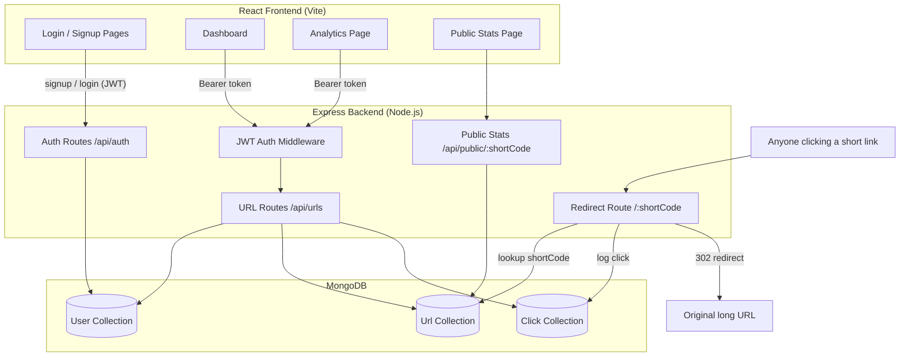

# AI Planning Document — shrnk.io URL Shortener

This document describes the planning process, architecture, and AI-assisted
workflow used to build this project, as required by the hackathon
submission guidelines.

## 1. Planning Approach

The project was planned in this order before any code was written:

1. **Break down the problem statement** into three core domains: Auth,
   URL management (CRUD + redirect), and Analytics.
2. **Design the data model first** — `User`, `Url`, and `Click` collections —
   since the redirect logic, dashboard, and analytics all depend on this shape.
3. **Design the REST API contract** (routes, request/response shapes) before
   writing any frontend code, so the frontend could be built against a fixed
   contract.
4. **Pick a stack that maximizes AI-assisted speed**: MERN (MongoDB, Express,
   React, Node) because it has the fewest moving parts for a 24-hour build
   and the best AI tooling support.
5. **Build backend first, then frontend**, verifying each layer (syntax
   checks, logic unit tests, a live `curl` test of the Express server) before
   moving on.
6. **Design the UI as a distinct visual identity** (not a generic admin
   template) — dark "developer tool" theme, short links rendered as
   ticket/tag chips, monospace for codes.

## 2. Feature List

### Mandatory features (all implemented)
- User signup & login with hashed passwords (bcrypt) and JWT auth
- Protected dashboard routes (frontend `ProtectedRoute` + backend `protect` middleware)
- Each user can only see/manage their own URLs (scoped by `user` field on every query)
- Create short URL from a long URL, with input validation (frontend + backend)
- Unique short code generation (`nanoid`, collision-checked against DB)
- Server-side redirect (`GET /:shortCode` → 302 redirect to original URL)
- Dashboard: list of URLs showing original URL, short URL, created date, total clicks
- Delete a shortened URL (and its click history)
- One-click copy of short URL
- Analytics: total click count, last visited time, recent visit history (up to 50), per-URL analytics page
- Responsive UI, loading/error/empty states, inline form validation messages

### Bonus features implemented
- Custom alias for short URLs (with reserved-word and uniqueness checks)
- QR code generation (downloadable PNG) for each short URL
- Expiry date for links (link returns `410 Gone` after expiry, shown as "Expired" badge)
- Charts for daily click trends (last 14 days, via Recharts bar chart)
- Public stats page (`/stats/:shortCode`) — no auth required, shows aggregate stats only
- Edit destination URL and expiry date after creation
- Bulk URL shortening via CSV/text file upload

### Bonus features intentionally not implemented (and why)
- **Geolocation / device analytics**: would require a third-party IP-geolocation
  service (cost/API key dependency) which conflicts with the "no external
  shortening/analytics service" spirit of the constraints and adds
  unnecessary external dependency risk for a hackathon build. Browser
  `userAgent` and referrer ARE captured and stored per click, so this can be
  added later without a schema change.
- **Deployment with live demo**: left to the developer to deploy (e.g.
  Render/Railway for backend, Vercel/Netlify for frontend) since it requires
  account-specific credentials not available in this environment.

## 3. Architecture Diagram

### Request flow summary

- **Auth flow**: `POST /api/auth/signup` and `POST /api/auth/login` issue a
  JWT, stored in `localStorage` on the client and attached as
  `Authorization: Bearer <token>` on every subsequent request via an Axios
  interceptor.
- **URL management flow**: All `/api/urls/*` routes are protected by the
  `protect` middleware, which verifies the JWT and attaches `req.user`.
  Every Mongo query is scoped with `{ user: req.user._id }` so users can only
  ever see their own links.
- **Redirect flow** (the "core logic"): `GET /:shortCode` is a public route
  registered *after* all `/api/*` routes so it doesn't shadow them. It looks
  up the `Url` document, checks expiry, asynchronously logs a `Click`
  document (timestamp, IP, user agent, referrer), increments `clickCount`
  and `lastVisitedAt`, then issues a `302` redirect to `originalUrl`.
- **Analytics flow**: `GET /api/urls/:id/analytics` returns total clicks,
  last visited time, the 50 most recent `Click` documents, and a
  MongoDB aggregation pipeline grouping clicks by day for the last 14 days
  (used for the chart).

## 4. Tech Stack

| Layer | Choice | Reasoning |
|---|---|---|
| Frontend | React 19 + Vite | Fast dev server, required by tech constraints |
| Styling | Tailwind CSS v4 | Rapid, consistent styling within a 24h window |
| Routing | React Router v6 | Standard for SPA protected routes |
| Charts | Recharts | Lightweight, React-native chart library |
| Icons | lucide-react | Clean, consistent icon set |
| Backend | Node.js + Express | Required by tech constraints |
| Database | MongoDB + Mongoose | Schema flexibility for analytics documents |
| Auth | JWT + bcryptjs | Stateless auth, industry-standard password hashing |
| Short code generation | nanoid | Collision-resistant, URL-safe IDs |
| QR codes | qrcode (backend) / qrcode.react (frontend) | Generates QR as data URL / canvas |

## 5. AI-Assisted Development Workflow

This project was built with Claude (Anthropic) as a pair-programming
assistant, following this workflow:

1. **Problem decomposition prompt**: asked Claude to read the problem
   statement and produce a build plan broken into backend models, API
   routes, frontend pages, and a prioritized build order given a tight
   deadline.
2. **Backend generation prompts**: asked Claude to scaffold the Express
   project (package.json, `.env.example`, MongoDB connection, Mongoose
   models for `User`, `Url`, `Click`), then generate the auth controller/routes,
   URL CRUD controller/routes, and the public redirect controller — one
   module at a time, with comments explaining each route's purpose.
3. **Validation prompts**: asked for a validators utility (URL validation,
   custom alias validation, reserved words) and centralized error-handling
   middleware (Mongoose duplicate-key and validation errors mapped to clean
   JSON responses).
4. **Frontend design prompt**: asked Claude to propose a distinct visual
   identity (not a generic admin dashboard) before writing UI code — settled
   on a dark "developer tool" theme with short links rendered as
   ticket/tag-style cards, Space Grotesk/Inter/JetBrains Mono type pairing.
5. **Frontend generation prompts**: scaffolded Vite + Tailwind, then built
   the auth context, protected routes, navbar, and each page (Login, Signup,
   Dashboard, Analytics, Public Stats) one at a time, wiring each to the
   matching backend route.
6. **Verification prompts**: ran `npm install`, `node --check` on every
   backend file, a standalone logic test for URL/alias validators and
   short-code generation, a live `curl` test of `/api/health` and
   `/api/auth/signup` validation, and a production `vite build` of the
   frontend to confirm there were no compile errors.

> During the actual hackathon submission, replace this section with your
> own real prompt history (e.g. exported chat log or screenshots), since
> reviewers will ask about the prompts used in the interview round.

---

This project is a part of a hackathon run by https://katomaran.com
